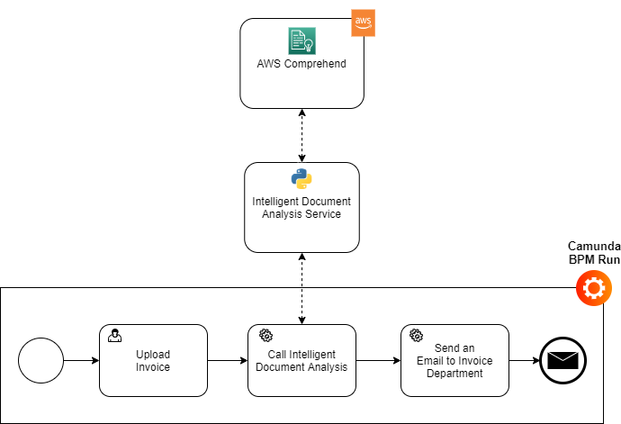
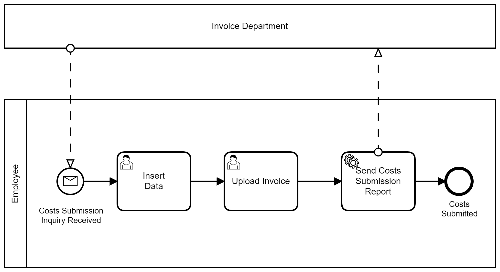
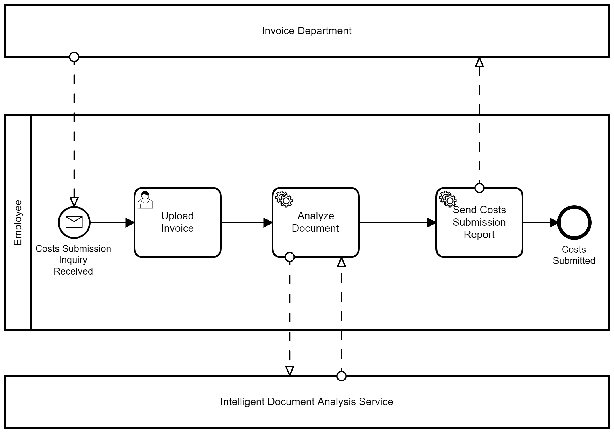
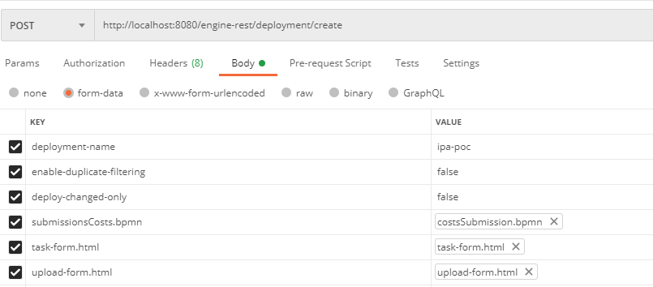
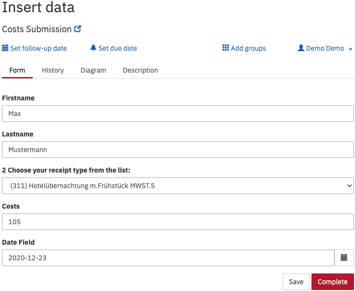
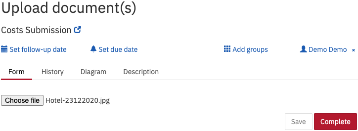

# Intelligent Process Automation - Showcase

This prototype demonstrates one possibility for transformation of a manual process into an intelligent process.

## Architecture Overview



## Sub-projects

### ida-service (Intelligent Document Analysis)

This folder contains the implementation of the External Task for Intelligent Document Analysis.
The task will connect to the Camunda process, receive the file for which we need the Intelligent Document Analysis, and then call the corresponding AWS.
At the end it sends the results to the running Camunda process.

### Camunda Distributions

#### poc-ipa-camunda-bpm-run

[Camunda BPM Run](https://docs.camunda.org/manual/7.14/user-guide/camunda-bpm-run/). 
The manual and intelligent processes are deployed automatically.

#### poc-ipa-micronaut

[Camunda Micronaut](https://github.com/NovatecConsulting/micronaut-camunda-bpm)

### Processes

The manual and intelligent processes developed for this project.
The processes are deployed automatically with the corresponding Camunda Distribution. 
The process lifecycle can also be handled with the REST-API.

### Manual Process



The user inserts the required data in an Embedded HTML form opening in Camunda Tasklist and uploads the relevant documents.
Afterwards,the process executes a script, to set internally the needed variables, and another script to send the data to the Invoice Department.

### Intelligent Process



The user uploads the required documents. The process calls the Intelligent Document Analysis Service that extracts the data and sends the response.
The Document and extracted data are sent to invoice by email.


# Setup

__Prerequisites__:

- Docker
- Docker Compose
- AWS Credentials (AWS_ACCESS_KEY_ID, AWS_SECRET_ACCESS_KEY)
- A DB Ticket in PDF (samples can be found [here](https://msnovatec.sharepoint.com/:f:/s/DX/EjeG0vbMbfxHg___LXI-cLsBHhOv_bnJMN40biBzMq2gzw?e=42aYaw))
- Postman (Optional)

__Steps__:

For reproduction we are using the Camunda BPM Run distribution.
The version Camunda Micronaut version of the PoC is currently based on a non publicly available code standard.

1. Clone the project:

```[GIT]
git clone https://gitlab.novatec-gmbh.de/data-x/intelligent-process-automation/poc-ipa.git
```

2. Navigate to the poc-ipa-camunda-bpm-run folder

3. Replace the mail-config-example.properties file with the mail-config.properties file retrieved from a project maintainer (Marigianna Skouradaki, MSK or Dusan Okanovic, DO).
It is located under poc-ipa-camunda-bpm-run/process-application/config
	
3. Replace the docker-compose-example.yml file with a docker-compose.yml file that contains your AWS Key credentials.

5. Start docker

6. Delete any old containers and images of the poc-ipa

7. Open a shell, navigate to the poc-ipa path and execute ```docker-compose up```

8. As soon as the containers are up and running the processes and artifacts are automatically deployed. The lifecycle of the process can be managed by Camunda Web-App (see below) or the Rest API. For the last we use [Postman](https://www.postman.com/):


9. Login to Camunda (http://localhost:8080, login:demo, pass:demo).

    To start the processes:

    Camunda Web-App:

    - Navigate to the Tasklist and for each process select the button "Start process" and then the process to start. Give a random number as Business Key.

    REST-API:

    - Import both collections from rest-api folder into Postman.
    - Update paths to process files and artifacts are needed.
    - Execute the requests "Deploy_Manual_Process", "Start_Manual_Process", "Deploy_Intelligent_Process", "Start_Intelligent_Processs" in this turn. Now both processes are deployed and started.

10. Complete the tasks (details can be found in the Usage section below).

11. Check that the email is sent to novatec.invoice@gmail.com.

12. You can execute ```docker-compose down``` to remove the running container.

## Usage

As soon as the process is deployed and the process instance is started use the Tasklist of [Camunda interface](http://localhost:8080/camunda/app/welcome/default/#!/login) (default Credentials are username: Demo, password: Demo) or [Rest API](https://docs.camunda.org/manual/latest/reference/rest/) to interact with the process. 
For Rest API we have provided the Postman collections in the rest-api folder of each Camunda distribution project.

In the manual process there are two forms to complete (can be found in the user TaskList): "task form" - to fill out the data about travel expense and "upload form" - to upload a copy of a receipt. A test file to upload can be found in ```data/example_input```.





## Configuration Details

(Gmail) The account that sends the email should allow the connection of [less secure apps](https://hotter.io/docs/email-accounts/secure-app-gmail/)

For the local version of the project, the file mail-config-example.properties should be renamed do mail-config.properties.
The password field should be replaced with the correct password to accessing the email. For this please consult one of the project maintainers (Marigianna Skouradaki or Dusan Okanovic).

## Current Limitations

The current version only works for .pdf files. It is assumed that every submission refers to one receipt and corresponding .pdf file
